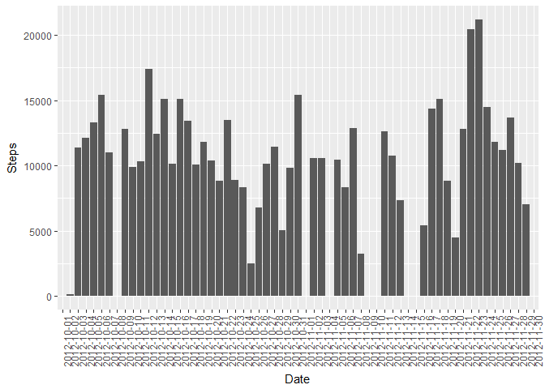
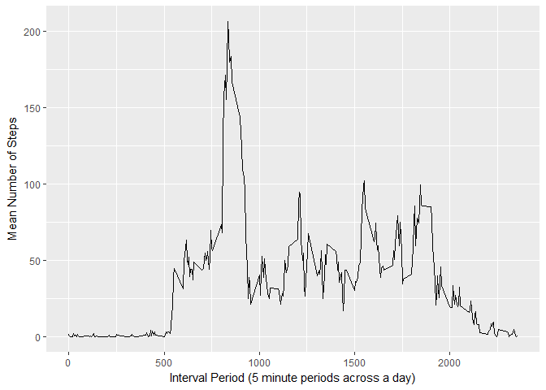
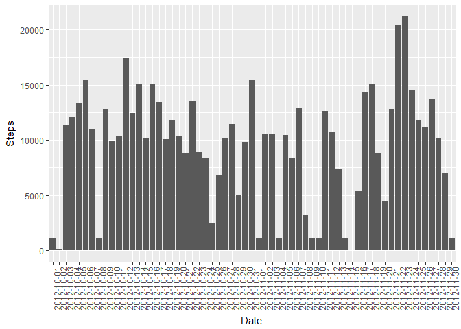
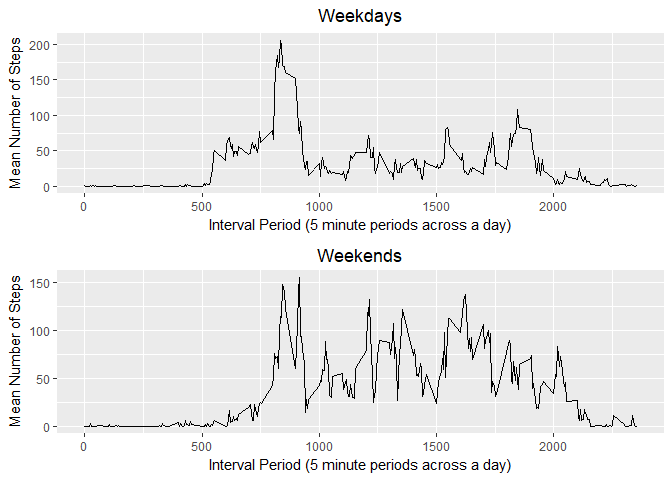

# PA1_template

This is a response to the Peer-graded Assignment: Course Project 1 for 
"Reproducible Research".

## 1) Loading and Preprocessing the Data

We'll start by reading in the data contained in 'activity.csv' and unzipping it 
from the saved folder:


```r
##Using the data.table package to import the data
require(data.table)
```

```
## Loading required package: data.table
```

```r
temp <- tempfile()
download.file("https://d396qusza40orc.cloudfront.net/repdata%2Fdata%2Factivity.zip", temp)
monitor_data <- fread(unzip(temp, files = "activity.csv"))
rm(temp)
```

A summary of the raw data shows a data file with 17568 entries, but also a
large number of missing values (represented as NA values) in the 'steps' variable.


```r
summary(monitor_data)
```

```
##      steps            date              interval     
##  Min.   :  0.00   Length:17568       Min.   :   0.0  
##  1st Qu.:  0.00   Class :character   1st Qu.: 588.8  
##  Median :  0.00   Mode  :character   Median :1177.5  
##  Mean   : 37.38                      Mean   :1177.5  
##  3rd Qu.: 12.00                      3rd Qu.:1766.2  
##  Max.   :806.00                      Max.   :2355.0  
##  NA's   :2304
```

These missing values are dealt with later on in this project. 

We'll create a data frame of the data that has been imported to work from.


```r
monitor_df <- data.frame(monitor_data)
```

## 2) What is mean total number of steps taken per day?

First, we need to aggregate the number of steps taken per day:


```r
monitor_hist <- aggregate(monitor_df$steps, by=list(Category=monitor_df$date), FUN = sum, na.omit = TRUE)

#renaming the variables for clarity

names(monitor_hist)[names(monitor_hist)=="Category"] <- "Date"
names(monitor_hist)[names(monitor_hist)=="x"] <- "Steps"
```

Then, we need to create a histogram showing the total number of steps taken each day:


```r
## Loading ggplot to create the histogram

require("ggplot2")
```

```
## Loading required package: ggplot2
```

```r
ggplot(data=monitor_hist, aes(Date, Steps)) +
        stat_summary(fun.y = sum, 
                     geom = "bar") + 
        theme(axis.text.x = element_text(angle = 90, hjust = 1))
```

```
## Warning: Removed 8 rows containing non-finite values (stat_summary).
```

<!-- -->

Finally for this question, we need to report the mean and median for the total 
number of steps per day (excluding the missing values):


```r
#The mean is rounded to two decimal places

paste("The mean number of steps per day is:", round(mean(na.omit(monitor_hist$Steps)), 2))
```

```
## [1] "The mean number of steps per day is: 10767.19"
```

```r
paste("The median number of steps per day is:", median(na.omit(monitor_hist$Steps)))
```

```
## [1] "The median number of steps per day is: 10766"
```

## 3) What is the average daily activity pattern?

To answer this, first we make a time series plot of the interval data:


```r
## Loading ggplot to create the time series plot

require("ggplot2")

#calculating the mean numbers of steps per interval, then renaming the variables

monitor_line <- aggregate(monitor_df$steps, by=list(Category=monitor_df$interval), FUN = mean, na.rm=TRUE)

names(monitor_line)[names(monitor_line )=="Category"] <- "interval"
names(monitor_line)[names(monitor_line)=="x"] <- "steps_mean"

##creating the time series plot

ggplot(monitor_line, aes(interval, steps_mean)) + geom_line() +
        xlab("Interval Period (5 minute periods across a day)") + ylab("Mean Number of Steps")
```

<!-- -->

From this process, we can then find the five minute interval period that contains
the maximum number of steps:


```r
#Identifying a data subset that contains the maximum steps mean value

monitor_line_max <- subset(monitor_line, steps_mean == max(steps_mean))

##outputting the interval with the maximum mean steps

paste("The interval (time of day) that the most number of steps are taken is:", monitor_line_max$interval)
```

```
## [1] "The interval (time of day) that the most number of steps are taken is: 835"
```

## 5) Imputing missing values

As indicated earlier, there are quite a few rows with missing values. 


```r
summary(monitor_df)
```

```
##      steps            date              interval     
##  Min.   :  0.00   Length:17568       Min.   :   0.0  
##  1st Qu.:  0.00   Class :character   1st Qu.: 588.8  
##  Median :  0.00   Mode  :character   Median :1177.5  
##  Mean   : 37.38                      Mean   :1177.5  
##  3rd Qu.: 12.00                      3rd Qu.:1766.2  
##  Max.   :806.00                      Max.   :2355.0  
##  NA's   :2304
```

These missing values are all in the 'steps' variable.


```r
paste("The total number of missing values in the 'steps' variable is:", sum(is.na(monitor_df$steps)))
```

```
## [1] "The total number of missing values in the 'steps' variable is: 2304"
```

To deal with these missing values we are going to replace the NA values with the
median values for that interval period.

Using this approach, we create a new data set with the missing values filled in 
with those median values.


```r
monitor_no_na <- monitor_data

monitor_no_na$steps[is.na(monitor_no_na$steps)] <- with(monitor_no_na, ave(steps, interval, 
                                          FUN = function(x) 
                                                  median(x, na.rm = TRUE)))[is.na(monitor_no_na$steps)]
```

In this modified data set, there are no missing values in the 'steps' variable.


```r
paste("The total number of missing values in the 'steps' variable in our modfied data set is now:", sum(is.na(monitor_no_na$steps)))
```

```
## [1] "The total number of missing values in the 'steps' variable in our modfied data set is now: 0"
```

We then look at a histogram of the new data set for comparison purposes, as well as
compare the mean and median of our modified data set compared to the previous one.


```r
## Loading ggplot to create the histogram

require("ggplot2")

monitor_no_na_hist <- aggregate(monitor_no_na$steps, by=list(Category=monitor_no_na$date), FUN = sum)

#renaming the variables for clarity

names(monitor_no_na_hist)[names(monitor_no_na_hist)=="Category"] <- "Date"
names(monitor_no_na_hist)[names(monitor_no_na_hist)=="x"] <- "Steps"

##running a histogram for the modified data set

ggplot(data=monitor_no_na_hist, aes(Date, Steps)) +
        stat_summary(fun.y = sum, 
                     geom = "bar") + 
        theme(axis.text.x = element_text(angle = 90, hjust = 1))
```

<!-- -->

Using the median to replace the missing values has changed some of the 
characteristics of the data.

As two examples, the modified data set has a lower mean and median than the 
dataset that includes the NA values.


```r
#calculating the new mean and median values, and then the differences between
#the two data sets

paste("The mean number of steps per day is the modified data is:", round(mean(monitor_no_na_hist$Steps), 2))
```

```
## [1] "The mean number of steps per day is the modified data is: 9503.87"
```

```r
paste("The median number of steps per day is the modified data is:", median(monitor_no_na_hist$Steps))
```

```
## [1] "The median number of steps per day is the modified data is: 10395"
```

```r
paste("The difference in mean between the unmodified and modified data sets are:", (round(mean(monitor_no_na_hist$Steps), 2))-round(mean(na.omit((monitor_hist$Steps), 2))))
```

```
## [1] "The difference in mean between the unmodified and modified data sets are: -1263.13"
```

```r
paste("The difference in median between the unmodified and modified data sets are:", median(monitor_no_na_hist$Steps)-median(na.omit(monitor_hist$Steps)))
```

```
## [1] "The difference in median between the unmodified and modified data sets are: -371"
```

This is because means and medians can be overstated for a data set if NA values
aren't considered. Replacing the NA values with the median values means that 
a data set will end up with reduced variation and will see central tendancy measures 
shift towards the mid dataset values.

## 6) Are there differences in activity patterns between weekdays and weekends?

Let's now look at the differences in activity by weekday and weekend.

We'll start by assigning either 'weekdays' or 'weekends' to the cases based on 
the date value.


```r
#assigning the day type to the date value

monitor_no_na$date <- as.Date(monitor_no_na$date)

weekdays1 <- c('Monday', 'Tuesday', 'Wednesday', 'Thursday', 'Friday')

monitor_no_na$day_type <- c('weekend', 'weekday')[(weekdays(monitor_no_na$date) 
                                                   %in% weekdays1)+1L]

paste("The data set contains ", sum(monitor_no_na$day_type == 'weekday'), "weekdays and ", sum(monitor_no_na$day_type == 'weekend'), "weekend days.")
```

```
## [1] "The data set contains  12960 weekdays and  4608 weekend days."
```

Now we'll plot weekday results versus weekend results by mean steps per interval.


```r
##using gridExtra to arrange the plots at the end
require(gridExtra)
```

```
## Loading required package: gridExtra
```

```r
##creating separate weekend and weekday datasets to calculate the difference means
monitor_weekday <- subset(monitor_no_na, day_type == "weekday")

monitor_weekday_line <- aggregate(monitor_weekday$steps, by=list(Category=monitor_weekday$interval, monitor_weekday$day_type), FUN = mean)

names(monitor_weekday_line)[names(monitor_weekday_line )=="Category"] <- "interval"
names(monitor_weekday_line)[names(monitor_weekday_line)=="x"] <- "steps_mean"
names(monitor_weekday_line)[names(monitor_weekday_line)=="Group.2"] <- "day_type"


monitor_weekend <- subset(monitor_no_na, day_type == "weekend")

monitor_weekend_line <- aggregate(monitor_weekend$steps, by=list(Category=monitor_weekend$interval, monitor_weekend$day_type), FUN = mean)

names(monitor_weekend_line)[names(monitor_weekend_line )=="Category"] <- "interval"
names(monitor_weekend_line)[names(monitor_weekend_line)=="x"] <- "steps_mean"
names(monitor_weekend_line)[names(monitor_weekend_line)=="Group.2"] <- "day_type"

##creating the time series plot for weekday and weekend findings

weekday_plot <- ggplot(monitor_weekday_line, aes(x=interval, y=steps_mean)) + 
        geom_line() + ggtitle("Weekdays") +
        theme(plot.title = element_text(hjust = 0.5)) +
        xlab("Interval Period (5 minute periods across a day)") + ylab("Mean Number of Steps")

weekend_plot <- ggplot(monitor_weekend_line, aes(x=interval, y=steps_mean)) + 
        geom_line() + ggtitle("Weekends") +
        theme(plot.title = element_text(hjust = 0.5)) +
        xlab("Interval Period (5 minute periods across a day)") + ylab("Mean Number of Steps")

grid.arrange(weekday_plot, weekend_plot)
```

<!-- -->

Overall, there are fewer steps taken across the weekend than on weekdays.
